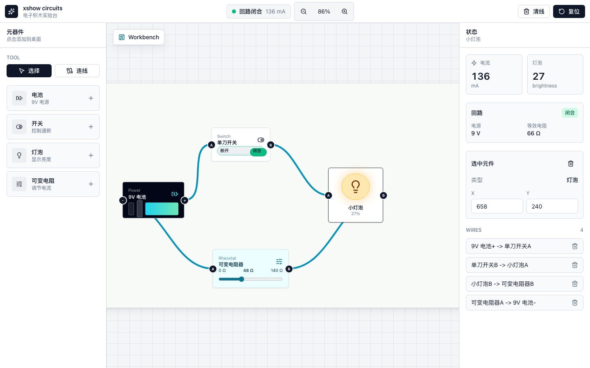
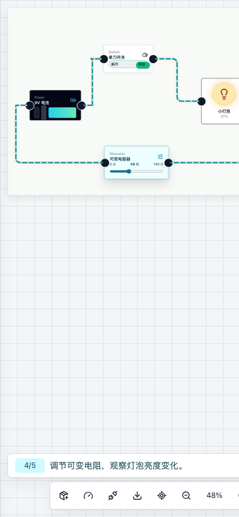

# xshow circuits

一个用 Vue 3、Vite、TypeScript 和 Tailwind CSS 构建的交互式电子积木电路实验台。

**在线演示：** https://labs.freexlib.com

`xshow circuits` 是一个早期教育原型，目标是让用户像拼电子积木一样搭建简单电路。你可以把电池、开关、灯泡、蜂鸣器、电机、导线、可变电阻器连接起来，切换开关，调节电阻，并立即看到电路状态变化。





## 功能

- 在工作台上拖动电子元器件
- 从一个端子拖到另一个端子即可创建导线
- 拖动已有导线端点即可重新连接
- 按住 Alt 拖动已有导线端点，可以从同一个端子拉出新的分支导线
- 点击开关控制电路通断
- 反转电池极性后，导线电流方向和 LED 正反接状态会同步更新
- 拖动可变电阻滑杆改变灯泡亮度
- 模拟蜂鸣器在通电闭合回路中的响铃状态
- 模拟电机在通电闭合回路中的转动状态
- 模拟有正负极的 LED，并提示反接和电流偏大
- 在通电导线上显示电流流动动画
- 在多个引导式实验之间切换，并自动检查实验步骤
- 包含基础、断路、调亮、串联、并联和 LED 引导实验
- 一键加载实验初始工作区
- 为当前未完成实验步骤显示上下文提示
- 在工作台上高亮当前步骤相关的元器件和端子
- 在手机和平板上使用画布优先的 HUD、器件抽屉和状态浮窗
- 在触控设备上平移、缩放工作台，并使用更大的端子和导线热区
- 可以添加到主屏幕作为 PWA 使用，并缓存核心静态资源以支持离线再次打开
- 在同一浏览器中自动恢复上次工作台状态
- 手动暂存带名称的本地工作台记录，用来保存实验中间过程
- 使用邮箱密码登录，并在当前浏览器中保持云端会话
- 跨设备保存、加载、重命名和删除云端工作台记录
- 将当前工作台导入或导出为 JSON 存档，方便跨设备迁移
- 复制分享链接，打开后可以恢复当前工作台状态
- 显示回路状态、电流、等效电阻和灯泡亮度
- 支持删除、取消、微调、复制、缩放、撤销和重做等编辑器式快捷键
- 将当前工作台导出为 PNG 图片
- 一键清空导线或恢复默认演示电路

## 当前范围

这个项目目前是一个偏教学演示的交互原型，不是完整的 SPICE 级电路仿真器。

当前模型主要关注简单闭合回路：

- 电池提供固定 9V 电源，并支持反转正负极
- 开关可以断开或闭合电路
- 可变电阻会改变等效电阻
- 灯泡亮度根据模拟电流路径计算得出
- 蜂鸣器接入通电回路后会显示响铃状态
- 电机接入通电回路后会显示转动状态
- LED 只有在正向连接时才会导通

## 技术栈

- Vue 3
- Vite
- TypeScript
- Tailwind CSS
- Pinia
- Vue Router
- lucide-vue 图标
- shadcn-vue 风格的本地组件
- v0.3 云端记录使用 Supabase 客户端

## 本地运行

```bash
pnpm install
pnpm dev
```

然后打开 Vite 输出的本地地址，通常是：

```text
http://localhost:5173
```

可选的云端同步配置：

```bash
cp .env.example .env.local
# 填入 VITE_SUPABASE_URL 和 VITE_SUPABASE_ANON_KEY
```

## 脚本

```bash
pnpm dev
pnpm build
pnpm preview
```

## 怎么使用

1. 直接拖动元器件主体，就可以在工作台上移动它。
2. 从一个端子拖到另一个端子，就可以创建导线。
3. 拖动已有导线两端的小圆点，可以重新连接到其他端子。
4. 按住 Alt 拖动已有导线端点，可以从同一个端子拉出新的分支导线。
5. 点击开关控制电路断开或闭合。
6. 选中电池后点击反转极性，观察电流方向变化。
7. 拖动可变电阻器滑杆，观察灯泡亮度变化。
8. 在手机和平板上，可以用底部 HUD 呼出器件面板、状态浮窗、导出图片、回正视图、缩放工作台。
9. 使用 **导出** 将当前工作台保存为 PNG 图片。
10. 使用 **记录** 暂存和加载带名称的本地工作台快照。
11. 使用 **导入 JSON / 导出 JSON** 在不同设备之间迁移当前工作台。
12. 使用 **复制分享链接** 把当前工作台状态发送给别人。
13. 使用 **清线** 断开所有导线。
14. 使用 **复位** 恢复默认演示电路。

快捷键：

- `Delete` / `Backspace`：删除选中的元器件或导线
- `Esc`：取消当前拖线/拖拽状态，或清除选中
- 方向键：每次微调选中元器件 4px，按住 `Shift` 时每次 16px
- `Cmd/Ctrl + Z`：撤销，`Cmd/Ctrl + Shift + Z` 或 `Cmd/Ctrl + Y`：重做
- `Cmd/Ctrl + D`：复制选中的元器件
- `Enter` / `Space`：切换选中的开关
- `+` / `-` / `0`：放大、缩小、回正视图

## 自动部署

推送到 `main` 后，可以通过 GitHub Actions 自动构建，并通过 SSH 把静态产物发布到云服务器。配置方式见 [docs/DEPLOYMENT.zh-CN.md](docs/DEPLOYMENT.zh-CN.md)。

## 路线图

当前项目方向见 [docs/ROADMAP.zh-CN.md](docs/ROADMAP.zh-CN.md)。

版本待完成清单见 [docs/release-backlog.zh-CN.md](docs/release-backlog.zh-CN.md)。

云端记录和跨设备同步计划见 [docs/cloud-sync-plan.zh-CN.md](docs/cloud-sync-plan.zh-CN.md)。

v0.2 发布说明见 [docs/releases/v0.2.0.zh-CN.md](docs/releases/v0.2.0.zh-CN.md)，QA 记录见 [docs/v0.2-qa-report.zh-CN.md](docs/v0.2-qa-report.zh-CN.md)。

## 贡献说明

见 [CONTRIBUTING.md](CONTRIBUTING.md)。更新文档时，请同步维护英文和中文版本。

近期优先级：

- 当前重点：v0.4 更多元器件和更真实规则
- v0.1 已完成：电流方向动画
- v0.1 已完成：引导式实验课程模式第一版
- v0.1 已完成：多个引导式实验
- v0.2 已完成：有正负极的 LED 元器件和配套实验
- v0.4 第一版：蜂鸣器、电机元器件和通电状态反馈
- v0.1 已完成：一键加载实验初始工作区
- v0.1 已完成：当前未完成步骤提示
- v0.1 已完成：当前实验步骤的工作台高亮
- v0.1 已完成：去掉选择/连线模式按钮，改成直接拖拽式导线交互
- v0.1 已完成：本地自动保存和带名称的工作台记录
- v0.2 已完成：通过 URL 分享工作台状态
- v0.2 已发布：移动端 HUD、触控平移缩放和更大的操作热区
- v0.2 已发布：串联、并联和 LED 电路示例
- v0.2 已发布：导出当前工作台为图片
- v0.2 已发布：PWA 安装、离线再次打开、新版本提示和 JSON 工作台存档
- v0.3 功能完成：Supabase 登录入口、云端记录、重命名、冲突处理和同步状态

## 许可证

Apache-2.0
